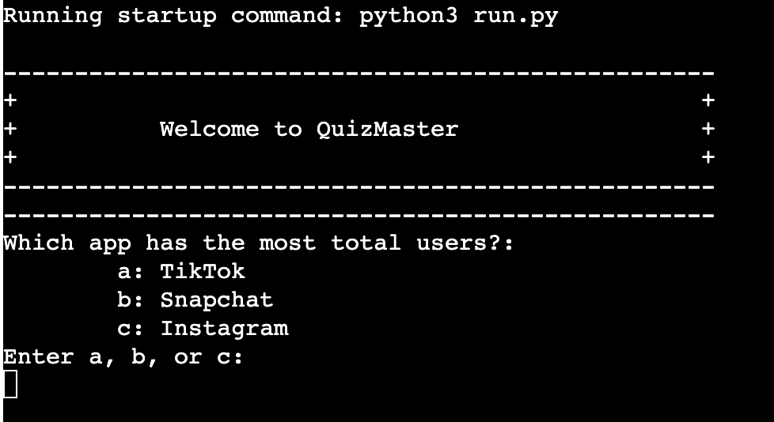
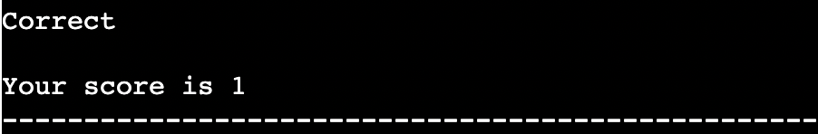
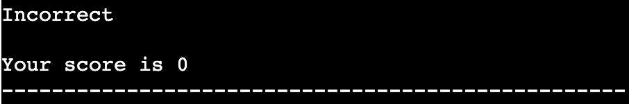
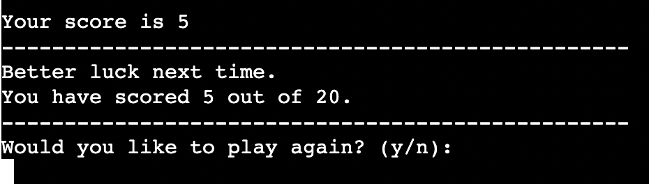
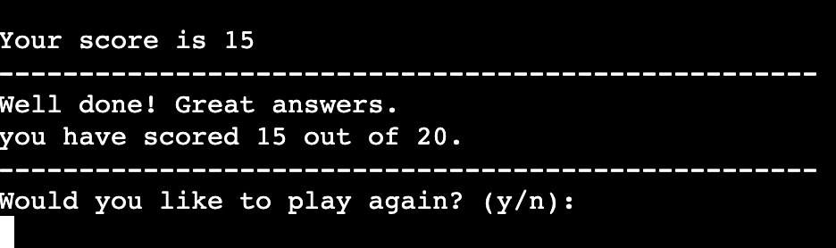
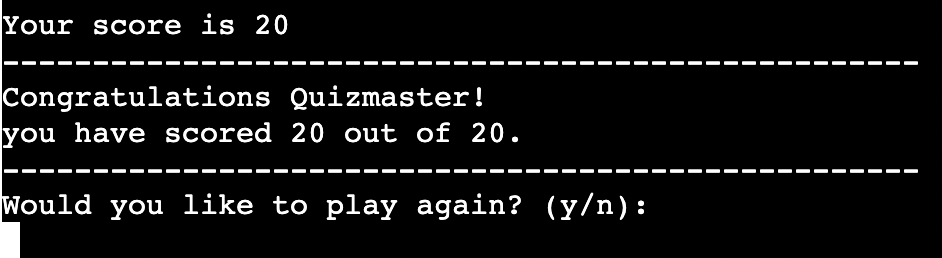
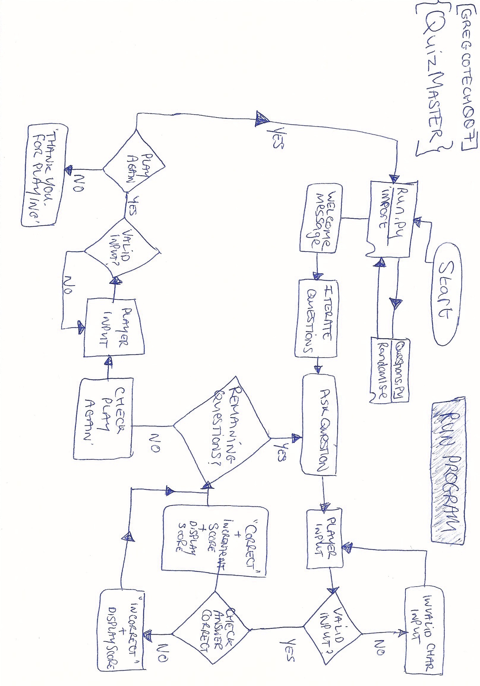
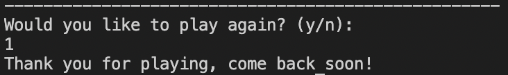
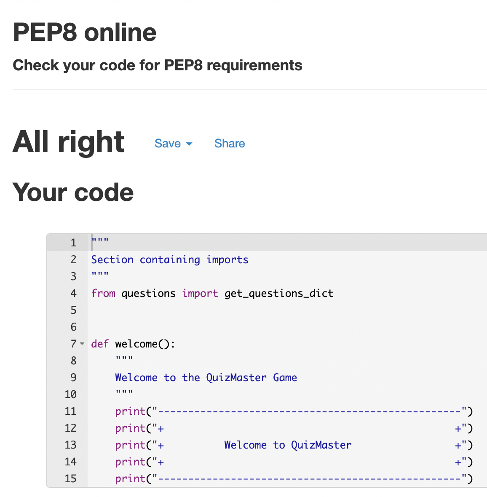
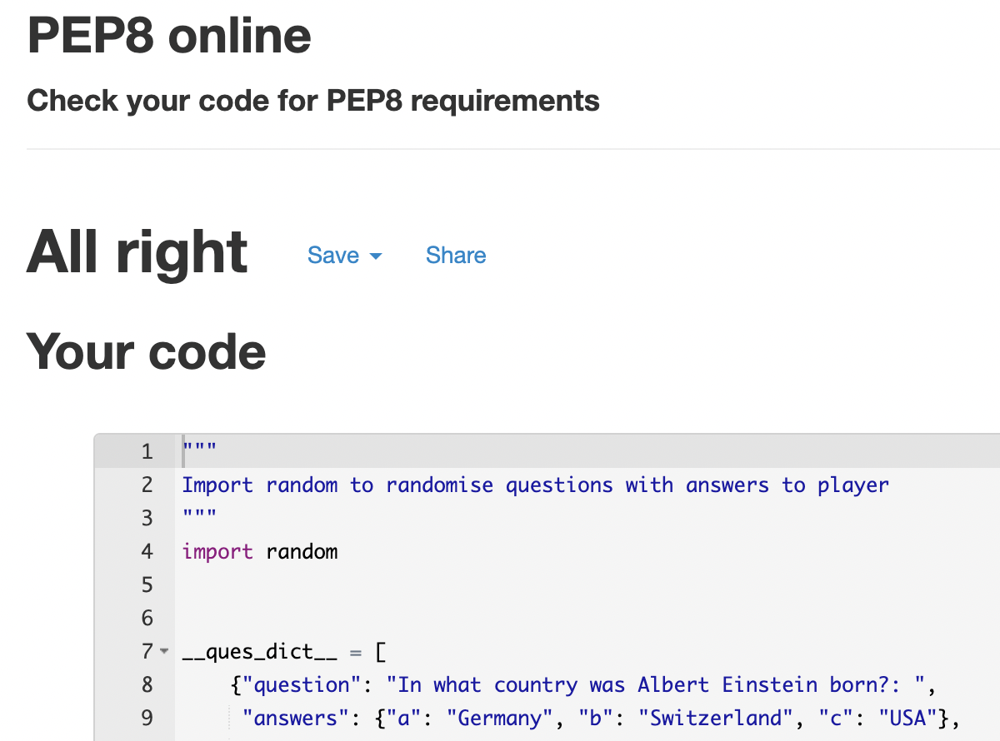

<!-- TOC start -->
- [QuizMaster => A multiple-choice quiz game made in Python](#quizmaster-a-multiple-choice-quiz-game-made-in-python)
  * [About QuizMaster](#about-quizmaster)
  * [How to Play!](#how-to-play)
- [User Experience (UX)](#user-experience-ux)
  * [User Story](#user-story)
- [Features](#features)
  * [Title Section](#title-section)
  * [Answers & Scoring](#answers-scoring)
- [Technology Used](#technology-used)
  * [Language](#language)
    + [Python](#python)
    + [Python - Libraries](#python-libraries)
  * [Data Model](#data-model)
    + [Python - Flow Control](#python-flow-control)
    + ['while' loop](#while-loop)
    + ['for' loop](#for-loop)
    + ['if' statement](#if-statement)
    + [__main__ — Top-level code environment](#__main__-top-level-code-environment)
  * [Programs](#programs)
- [Testing](#testing)
  * [Devices & Browsers](#devices-browsers)
  * [Bug Testing](#bug-testing)
  * [Code Validation](#code-validation)
- [Deployment](#deployment)
  * [Heroku](#heroku)
- [Cloning](#cloning)
- [Credits](#credits)
  * [Tutorials & Resources](#tutorials-resources)
  * [Acknowledgements](#acknowledgements)
<!-- TOC end -->
<!-- TOC -->
# QuizMaster => A multiple-choice quiz game made in Python
[View the Live Project here - QuizMaster](https://p3-mc-quiz.herokuapp.com/)

<!-- TOC -->
## About QuizMaster
The game "QuizMaster" is an online interactive game that provides a list of questions to the player and provides
3 multiple-choice answers to choose from. 

<!-- TOC -->
## How to Play!
After the website link loads, the user is presented with the welcome message and is then asked the first randomised question.
The player is asked to input a, b, or c. Once they enter the character and hit the return key, their answer is submitted and checked against the correct answer. If the player submits as blank, or as a character or number that does not match, they will be asked to enter their response again. The player will be asked continually until they enter a valid input as a, b or c only.
If the answer is correct, their score is incremented by 1 and the running total score is presented to the player with a message saying the answer is correct.
If the user gets the question incorrect, their score does not change and the player is presented with their running
total score and a message that they got the question incorrect.
Once the player has attempted all questions, they will then be presented with their final score. It is broken down into 
3 results:
    - less than or equal to 5 = "Better luck next time." with total score provided.
    - less than or equal to 15 = "Well done, great answers" with total score provided.
    - greater than 15 = "Congratulations Quizmaster!" with total score provided.
The player is then offered the option to play again by entering y/Y for Yes or n/N for No.
If the player selects 'y', the quiz game starts again.
If the player selects 'n', the player is presented with a message saying "Thank you for playing, come back soon!".

<!-- TOC -->
# User Experience (UX)
<!-- TOC -->
## User Story
Target Audience – A general audience of adults of all ages who would like to test their general knowledge of a multiple-choice quiz game.
- Play the game across different devices and browsers.
- Understand how to play the game.
- Play a game without a timer function.
- Know if the answer was correct or incorrect.
- Know the running total of my score.
- Know what happens if invalid or blank information is submitted.
- Have the option to play again or to finish the quiz game completely.
- Know the final score and how many questions were correct out of the total number of questions.
- To have fun.
The above user story is addressed in the following sections in more detail below. It gives a better explanation of the game in the form of examples and screenshots.

<!-- TOC -->
#  Features
<!-- TOC -->
## Title Section
A welcome message is presented to the player when the game is started.

<!-- TOC -->
## Answers & Scoring
The player is presented with a multiple choice question at random and they are asked to choose a, b or c as their answer to submit. When the player enters a, b or c and hits enter, their answer is then validated. The player's score is incremented by 1 if correct and presented with a message to say they got it correct.

If the answer is incorrect, the playr is presented with a message saying their answer is incorrect and it shows their score does not change.

The player continues to answer all questions until the final question has been answered.
When all answers have been attempted, the player is then presented with their total score.
- For a score 0 to 5, the player is presented with the following message:

- For a score 6 to 15, the player is presented with the following message:

- For a score greater than 15, the player is presented with the following message:

- If the user experiences any issues with the game response, they can simply click on the "Run Program" button to restart the game.

<!-- TOC -->
# Technology Used
<!-- TOC -->
## Language
<!-- TOC -->
### Python
[Python](https://www.python.org/doc/essays/blurb/) is an interpreted, object-oriented, high-level programming language with dynamic semantics. Its high-level built in data structures, combined with dynamic typing and dynamic binding, make it very attractive for Rapid Application Development, as well as for use as a scripting or glue language to connect existing components together.

<!-- TOC -->
### Python - Libraries
[Python Libraries](https://docs.python.org/3/glossary.html#term-importing) - The term 'import' allows the process by which Python code in one module is made available to Python code in another module.
In my case, my multiple-choice were store in a seperate file called 'questions.py'. 
The questions were randomised using the 'import random' library and I then used the import statement at the top of the questions.py file to action it.
In the section containing the imports, I then was able to import 'get_questions_dict' from questions.py and calling it at the top of run.py 

<!-- TOC -->
## Data Model
The data from the player input was stored appropriately and passed into methods which are explained below in the while & for loops and if statements and handled using flow control.

The above flow control diagrom shows the control and flow of the game. 
<!-- TOC -->
### Python - Flow Control
[Compound Statements](https://docs.python.org/3/reference/compound_stmts.html) - Compound statements contain (groups of) other statements; they affect or control the execution of those other statements in some way. In general, compound statements span multiple lines, although in simple incarnations a whole compound statement may be contained in one line.

<!-- TOC -->
### 'while' loop
The 'while' loop was used to check the player's input answer. If the player submitted a numeric, blank or another character that did not match a, b, or c, then the while loop would continue to ask the player for an input that requires the correct valdiation response.
Once the player enters the correct, a, b or c responce, then the 'while' loop finishes and continues with the rest of the program.

<!-- TOC -->
### 'for' loop
The 'for' loop was used to interate through each randomised quiz question & answer, up until the maximum lenght of questions have been asked.

<!-- TOC -->
### 'if' statement
The 'if' statement was used to check if the player answer submitted, matches the correct answer.
If answer is correct, then a print message is presented to the player that they got the answer correct, their score is incremented by one and then players running total score is diplayed.
If answer is incorrect, then a print message is presented to the player that they got the answer incorrect, their score remains unchanged and the player's running total score is diplayed.

<!-- TOC -->
### __main__ — Top-level code environment
In [Python](https://docs.python.org/3/library/__main__.html#module-__main__), the special name __main__ is used for two important constructs:
- the name of the top-level environment of the program, which can be checked using the __name__ == '__main__' expression;
- the __main__.py file in Python packages.
__main__ is the name of the environment where top-level code is run. “Top-level code” is the first user-specified Python module that starts running. It’s “top-level” because it imports all other modules that the program needs. Sometimes “top-level code” is called an entry point to the application.

<!-- TOC -->
## Programs
- [GitHub](https://github.com/):
    - GitHub was used to backup instances of GitPod Workspaces at intervals.
- [GitPod](https://gitpod.io/):
    - GitPod was used as the main Language Editor for programming the website.
- [Heroku](https://www.heroku.com/):
    - Heroku was used as the deployment platform for the CLI (command line interface) quiz game.
<!-- TOC -->
# Testing
<!-- TOC -->
## Devices & Browsers
- MacBook Pro
The QuizMaster game was tested on MacBook Pro running the latest MacOS Monterey (12.2.1) and Google Chrome (Version 99.0.4844.51 (Official Build) (arm64)). 
The quiz game performed well without issues and took input from the keyboard.
I also tested the QuizMaster game on the same device MacBook Pro running the latest MacOS Monterey (12.2.1) and Safari (Version 15.3). The quiz game loaded up correctly and displayed the welcome message and first question for player input, but it did not take any keyboard input response and therefore I was unable to play it.
- Windows 10
The QuizMaster game was tested on Windows 10 running Google Chrome (Version 98.0.4768.102 (Official Build)(64-Bit)).
The quiz game performed well without issues and took input from the keyboard.
I also tested it on the same Windows 10 computer running Microsoft Edge (Version 98.0.1108.56 (Official build)(64-Bit)) and also Mozilla Firefox (Version 97.0.1 (64-Bit)).
Both browsers worked seamlessly without any issues.
<!-- TOC -->
## Bug Testing
I found a bug when testing the play again option that they player was able to submit anything, for example, a number, as per the screenshot example and it responded as if the user selected n for no.

<!-- TOC -->
## Code Validation
- [PEP8 Online](http://pep8online.com/):
    - This website was used validate the Python code for any errors.
    
    

<!-- TOC -->
# Deployment
Before deploying to Heroku, a requirements.txt was created by typing and submitting the following code:
pip3 freeze
Log in to Heroku with login credentials or create a new account if required.
When logged in, click the button labelled "New" from the dashboard in the top right corner.
From the "New" drop-down menu, select "Create New App".
A unique app name must be chosen. I chose "p3-mc-quiz".
Select a region, "United States" or "Europe". I chose "Europe" for my region.
Click on the "Create App" button.
On the next page, select the "Settings" Tab.
There is an option to create Config Vars", but in my case, there were not required.
On the Build Packs section, choose to add the following in the set order:
    - heroku/python
    - heroku/nodejs
Click on python and save changes, then nodejs and save changes.
Scroll to the top of the page and now choose the Deploy tab.
Select Github as the deployment method.
Confirm you want to connect to GitHub and sign-in with GitHub credentials, if required.
Search for the repository name and click the connect button.
Scroll to the bottom of the deploy page and select preferred deployment type:
Choose either "Enable Automatic" Deploys for automatic deployment when you push updates to Github or you can choose "Manual" which allows you to manually deployment when required.
Select the correct branch for deployment from the drop-down menu and click Deploy Branch for manual deployment.
<!-- TOC -->
## Heroku
For deployment of the website to a live publicly accessible website, the following steps were required:
- Confirmed that correct repository is selected as 'quiz'
- Your site is published at https://p3-mc-quiz.herokuapp.com/
<!-- TOC -->
# Cloning
To clone a copy of the code in the repository, the following steps are required:
- Go to https://github.com and select the Repository called 'quiz'
- Click on the button called 'Code" and a pop-out window will show options to Clone through:
    - HTTPS
    - SSH
    - GitHub CLI
1. On GitHub.com, navigate to the main page of the repository.
2. Above the list of files, click  Code.
3. To clone the repository using HTTPS, under "Clone with HTTPS", click 'Clipboard to copy'. To clone the repository using an SSH key, including a certificate issued by your organization's SSH certificate authority, click Use SSH, then click 'Clipboard to copy'. To clone a repository using GitHub CLI, click Use GitHub CLI, then click 'Clipboard to copy'.
4. Open Terminal.
5. Change the current working directory to the location where you want the cloned directory.
6. Type > git clone and then paste the URL you copied earlier. 
    > $ git clone https://github.com/YOUR-USERNAME/YOUR-REPOSITORY
7. Press Enter to create your local clone.
    > $ git clone https://github.com/YOUR-USERNAME/YOUR-REPOSITORY
    > Cloning into `Spoon-Knife`...
    > remote: Counting objects: 10, done.
    > remote: Compressing objects: 100% (8/8), done.
    > remove: Total 10 (delta 1), reused 10 (delta 1)
    > Unpacking objects: 100% (10/10), done.
8. Repository Clone is now complete.

<!-- TOC -->
# Credits
<!-- TOC -->
## Tutorials & Resources
- [GitHub: Clone a Repo](https://docs.github.com/en/repositories/creating-and-managing-repositories/cloning-a-repository)
- [Geek Tutorials: Multiple Choice Quiz](https://www.youtube.com/watch?v=myJ36xIR7Ygcloning-a-repository)
- [The Net Ninja: Python 3 Tutorials for Beginners](https://www.youtube.com/playlist?list=PL4cUxeGkcC9idu6GZ8EU_5B6WpKTdYZbK)
- [Joshua Bastean: Python: While Loop for Input Validation](https://www.youtube.com/watch?v=eF5mObNHeek)
- [Real Python: How to Iterate Through a Dictionary in Python](https://realpython.com/iterate-through-dictionary-python/)
- [PEP 8 – Style Guide for Python Code](https://peps.python.org/pep-0008/)
- [Markdown TOC generator](https://derlin.github.io/bitdowntoc/)

<!-- TOC -->
## Acknowledgements
- [Code Institute](https://codeinstitute.net)
    - The LMS tutorials were beneficial in giving me an insight into starting my first Python coding project.
    - Thanks to my Mentor who supported me throughout the project.
    - Thanks to my fellow students in our Code Institute Slack Channels.
    - Thanks to Code Institute Student Care Support & Kasia for all the help and support.
